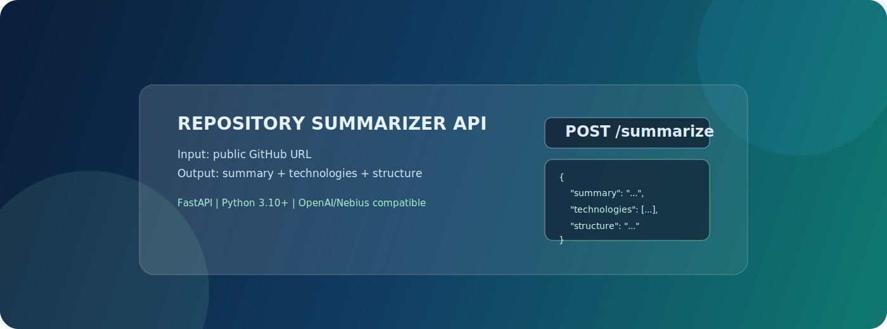
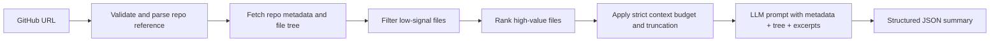

# Repository Summarizer API

<p align="center">
  
</p>

<p align="center">
  <a href="#"></a>
  <a href="#"></a>
  <a href="#"></a>
  <a href="#"></a>
</p>

## Project in One Screen

| Panel | Details |
|---|---|
| Purpose | Input a public GitHub URL, output a human-readable project summary. |
| Output schema | `summary` (string), `technologies` (string[]), `structure` (string). |
| Core promise | Works on real repos by filtering noisy files and fitting context budget. |
| Runtime | FastAPI + OpenAI SDK (OpenAI or Nebius-compatible endpoint). |

## Why this style

This README is intentionally structured like a compact "bento" dashboard with visual hierarchy, collapsible deep sections, and a diagram-first explanation flow.

## Setup on a Clean Machine

1. Create and activate a virtual environment.

```bash
python3 -m venv .venv
source .venv/bin/activate
```

2. Install dependencies.

```bash
pip install -r requirements.txt
```

3. Create `.env` from the template.

```bash
cp .env.example .env
```

4. Set at least one provider key in `.env`.

```bash
# if using OpenAI
OPENAI_API_KEY=your_openai_api_key

# optional alternative provider
# NEBIUS_API_KEY=your_nebius_api_key

# optional but recommended for higher GitHub API limits
GITHUB_TOKEN=your_github_token
```

5. Optional tuning knobs in `.env`.

```bash
OPENAI_MODEL=gpt-4o-mini
# OPENAI_BASE_URL=https://your-openai-compatible-endpoint/v1

# LLM_TIMEOUT_SECONDS=60
# LOG_DIR=logs
# LLM_MAX_RETRIES=3
# LLM_RETRY_BACKOFF_SECONDS=1.0
# GITHUB_MAX_RETRIES=3
# GITHUB_RETRY_BACKOFF_SECONDS=0.5
```

6. Start the API server.

```bash
uvicorn app.main:app --host 0.0.0.0 --port 8000
```

## Test the Endpoint

```bash
curl -X POST http://localhost:8000/summarize \
  -H "Content-Type: application/json" \
  -d '{"github_url":"https://github.com/psf/requests"}'
```

Success response shape:

```json
{
  "summary": "...",
  "technologies": ["..."],
  "structure": "..."
}
```

Error response shape:

```json
{
  "status": "error",
  "message": "Description of what went wrong"
}
```

## How the Service Thinks



## Model Choice

Default model is `gpt-4o-mini` when using OpenAI. It is a practical quality/cost tradeoff for repository summarization and keeps latency predictable. Nebius is supported via `NEBIUS_API_KEY` (or an OpenAI-compatible base URL).

## Repository Processing Strategy

1. Parse URL and load metadata + full tree from GitHub REST API.
2. Skip noisy or heavy paths/files (`node_modules/`, `dist/`, `build/`, binaries/images, lock files).
3. Prioritize files that explain intent and architecture (`README*`, dependency/config files, key source directories, docs).
4. Fetch only top-ranked candidates with hard limits (file count and total chars).
5. Truncate long files and send compact context to the LLM.

Result: meaningful summaries without overflowing model context.

## Configuration

| Variable | Purpose |
|---|---|
| `OPENAI_API_KEY` | Primary provider key (if set, OpenAI path is used first). |
| `NEBIUS_API_KEY` | Alternative provider key for Nebius Token Factory usage. |
| `OPENAI_MODEL` | Model name override (default `gpt-4o-mini`). |
| `OPENAI_BASE_URL` | Optional custom OpenAI-compatible endpoint. |
| `GITHUB_TOKEN` | Optional, improves GitHub rate limit. |
| `LOG_DIR` | Optional log directory (default `logs`). |

## Deep Dive

<details>
<summary><strong>Project structure</strong></summary>

```text
.
├── app
│   ├── main.py                     # FastAPI app, routes, middleware wiring
│   ├── config.py                   # Configuration/constants
│   ├── schemas.py                  # Request/response schemas and RepoRef dataclass
│   ├── logging_setup.py            # File logger setup
│   ├── error_handlers.py           # Global API error handlers
│   └── services
│       ├── repository_service.py   # GitHub fetching/filtering/context building
│       └── llm_service.py          # LLM prompt, call, retry, response parsing
├── assets
│   └── readme
│       └── hero.svg
├── requirements.txt
├── README.md
├── .env.example
└── .gitignore
```

</details>

<details>
<summary><strong>Edge cases and operational notes</strong></summary>

- Only public GitHub repositories are supported.
- GitHub unauthenticated rate limits apply when `GITHUB_TOKEN` is not set.
- If no suitable text files are found, the API returns `422`.
- `.env` is ignored via `.gitignore` to avoid committing secrets.
- Logs are written to `logs/app.log` using a rotating file handler.
- Errors are mapped to explicit HTTP responses: auth `401`, rate limit `429`, timeout `504`, provider failures `502`.
- Transient GitHub/LLM failures are retried with bounded exponential backoff.

</details>
